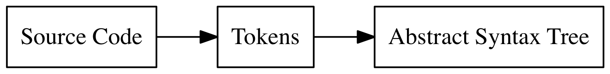

# Monkey Lang Interpreter

## Introduction
This repository hosts the implementations of a custom interpreter in multiple programming languages. 
This project is based on Thorston Ball's amazing book [Interpreter in GO](https://interpreterbook.com).

# Table of Contents

<!-- This should be table of contents -->
1. [Lexer](#lexer)
2. [Parser](#parser)

# Interpreter Elements
These are the elements mentioned in [Interpreter in GO](https://interpreterbook.com) in order of implementation.

## Lexer

Image is from [Interpreter in GO](https://interpreterbook.com) book.

The Lexer is responsible for converting from raw source code to datastructues called tokens. This will be consumbed by the parser.

## Parser

The parser is responsible for taking tokens and creating a abstract syntax tree (AST).
